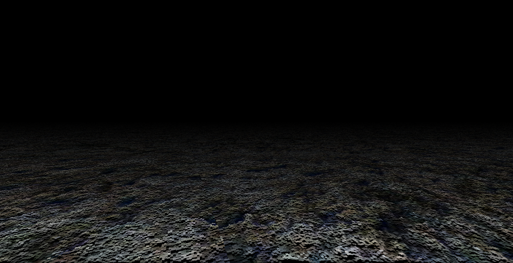

# RetroVFX

> Retro Visual Effects using old school techniques

 
 
 

## Executing

All the compiled binaries, both in release and debug can be found under the binaries folder. They are ready to execute and no further installation should be needed, however, note that:
* Moving the executables to a different folder could cause them to not work, since it could lead to unmet dependencies
* When executing on Linux, it is assumed that *OpenGL* and *libjack* are already installed and can be found on the system

## Building

This project has been built using the *gcc* compiler. It can be build both in Linux and Windows. Note, however, that for running on Windows, a software distribution such as [MSYS](https://www.msys2.org) is needed, and the *gcc* compiler and the *make* utility need to be installed on it.

For building everything on Windows, you can just execute the `build_all.sh` or `build_all_release.sh` scripts.

For building everything on Linux, you can just execute the `build_all_linux.sh` or `build_all_linux_release.sh` scripts.

If you just want to build a single demo on Windows, you can execute `make` + `name_of_the_demo` *(fire, dottunel, rotozoom, deformations, plasma, planes, geometry, finaldemo)*. The same applies for Linux but adding `_lin` to the name of the demo.

+ Example on Windows: `make fire`

+ Example on Linux: `make fire_lin`

## The motivation

This project was developed during the second half of 2018 and the first half of 2019 as my dissertation project for Multimedia Engineering. I received the highest grade and got honours for it.

My goal was to explore graphics from a low level perspective, restricting myself to graphics done only using the CPU on a single thread, as well of honouring the world of the *demoscene*.

The [demoscene](https://en.wikipedia.org/wiki/Demoscene) is a computer art subculture that is characterised by trying to create impressive technical demos and visual effects exploiting the limitations of the hardware.

Hence, this allowed me to explore the origin and foundations of computer graphics, learning useful techniques and understanding the base upon modern graphics are built on.

The dissertation essay (in Spanish) with in depth explanations of the algorithms implemented in code (and a tour exploring the *demoscene* world) can be found at the [repository](http://hdl.handle.net/10045/97008) of the University of Alicante.

## Characteristics

* All the effects are performed real time, on a CPU on a single thread.
* No external libraries are used for graphics creation. [GLFW](https://www.glfw.org) is used only for abstracting the window and input handling. [OpenGL](https://www.opengl.org) is only used to get access to a framebuffer that is then used to draw by manipulating a pixel array.
* No external libraries are used for sound creation. [PortAudio](http://www.portaudio.com) is used for abstracting the sound handling from the platform, but all the sound in the FinalDemo is generated on real time.

A really light weight graphic engine was created from scratch for:
*   Abstracting window
*   Abstracting input
*   Adding in the concept of pixel and its handling
*   Drawing dots, lines and rectangles
*   Drawing text
*   Loading images with the BMP format

As well as a really small math library for optimizing some computationally expensive operations (randomness and pre-calculated sine and cosine tables).

Before implementing all this code, some basic tests were run in order to understand which computational operations were more costly. Results and conclusions can be found [here](https://docs.google.com/spreadsheets/d/1wXpJJcMRNXa72UibdfpyQjdukwU2EzPT7qyCYGM_JLI/edit#gid=1074191207).

## The effects

### Fire

A really simple animated fire. Achieved by the convolution of two matrixes, getting a dissipation effect.

### Dot Tunnel

Dotted tunnel effect achieved by using growing dotted circles with a given lifetime. The trajectory is randomly defined by a turbulence path, result of the addition of different waves.

### RotoZoom

Simple effect that involves real time scaling and rotations. A mapping is performed from texture coordinates to screen coordinates.

### Deformations

<figure>
  <figcaption>No deformations</figcaption>
  
</figure>

<figure>
  <figcaption>Transversal wave on x</figcaption>
  
</figure>

<figure>
  <figcaption>Longitudinal wave on x</figcaption>
  
</figure>

<figure>
  <figcaption>Diamond (transversal on x and y)</figcaption>
  
</figure>

<figure>
  <figcaption>Mosaic (longitudinal on x and y)</figcaption>
  
</figure>

<figure>
  <figcaption>Flag (x depends on y)</figcaption>
  
</figure>

### Plasma

A simple plasma effect. Achieved by the addition of sine waves with different frequencies and phases whose value depends on the `x` and `y` coordinates of the pixel.

### Infinite Planes

Infinite planes illusion created by rotating and twisting a texture.

### Geometry

Geometry effect creating by simply projecting 3D points, with a fixed camera. Translation, scale and rotation operations can be applied over the models, which are just performed under the hood with simple math operations (faster than using matrixes for such a simple use case)

### Final Demo

Compilation of all the previous effects and some new techniques, implementing real time generated sound (using different types and combinations of waves (square, triangle, sawtooth and sine)).

A video of it can be found [here](https://youtu.be/wt8GP5n3uNc).

